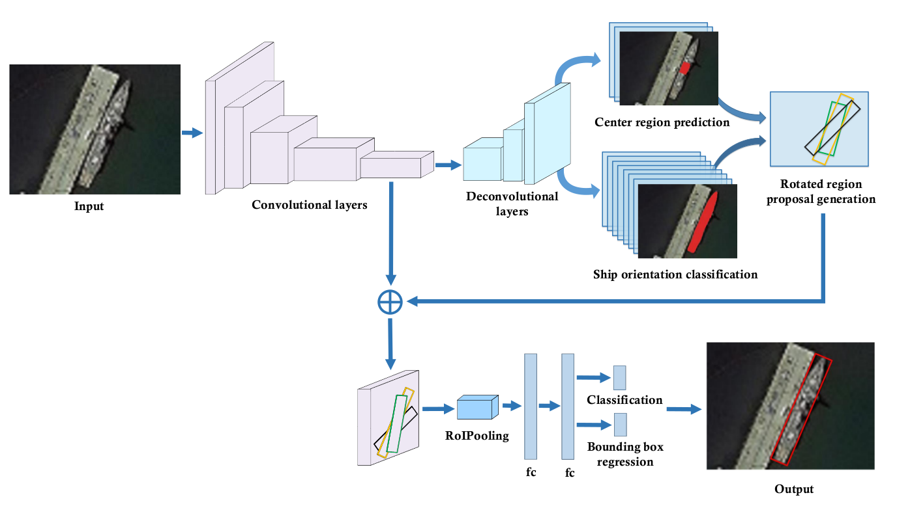

## Ship Detection in Optical Satellite Images via Directional Bounding Boxes Based on Ship Center and Orientation Prediction
By Jinlei Ma, Zhiqiang Zhou, Bo Wang, Hua Zong and Fei Wu

The paper has been published in *Remote Sensing* 11(18):2173, you can download the PDF from [here](https://www.researchgate.net/publication/335897064_Ship_Detection_in_Optical_Satellite_Images_via_Directional_Bounding_Boxes_Based_on_Ship_Center_and_Orientation_Prediction).

### Abstract: 

To accurately detect ships of arbitrary orientation in optical remote sensing images, we propose a two-stage CNN-based ship-detection method based on the ship center and orientation prediction. Center region prediction network and ship orientation classification network are constructed to generate rotated region proposals, and then we can predict rotated bounding boxes from rotated region proposals to locate arbitrary-oriented ships more accurately. The two networks share the same deconvolutional layers to perform semantic segmentation for the prediction of center regions and orientations of ships, respectively. They can provide the potential center points of the ships helping to determine the more confident locations of the region proposals, as well as the ship orientation information, which is beneficial to the more reliable predetermination of rotated region proposals. Classification and regression are then performed for the final ship localization. Compared with other typical object detection methods for natural images and ship-detection methods, our method can more accurately detect multiple ships in the high-resolution remote sensing image, irrespective of the ship orientations and a situation in which the ships are docked very closely. Experiments have demonstrated the promising improvement of ship-detection performance.



## Contents

1. <a href="#1">Software</a>
2. <a href="#2">Hardware</a>
3. <a href="#3">Dateset</a>
4. <a href="#4">Demo</a>
5. <a href="#5">Training</a>
6. <a href="#6">Testing</a>

## <a name="1">Software</a>

Ubuntu 16.04 + Anaconda + Python 2.7 + CUDA 8.0 + CUDNN 5.1.5

1. Get the code, the directory is ASD.

```
git clone https://github.com/JinleiMa/ASD.git
cd ASD
```

2. Build the code. Please follow [Caffe instruction](http://caffe.berkeleyvision.org/installation.html) to install all necessary packages and build it.

```
cp Makefile.config.example Makefile.config
makedir build
cd build
cmake ..
make all -j4 && make pycaffe
```

3. Some setting can be found in our "Makefile.config"
4. Note that our Caffe may be a little old, and using some new packages may have issues.
5. Our code is constructed based on [Faster RCNN](https://github.com/rbgirshick/py-faster-rcnn) and [RRPN](https://github.com/mjq11302010044/RRPN)

## <a name="2">Hardware</a>

NVIDIA GTX 1080 GPU (8G) + 16G RAM

Training our detection network with the input image of 512*384, you will need about 2G gpu.

## <a name="3">Dataset</a>

1. The ship dataset needs to put in "./dataset/Ship_Dataset" . The dataset format is based on [PASCAL VOC](http://host.robots.ox.ac.uk/pascal/VOC/). The format is as follows:

```python
Ship_Dataset
--------Annotations
----------------000001.xml
----------------000002.xml
--------JPEGImages
----------------000001.jpg
----------------000002.jpg
--------ImageSets
----------------Main
------------------------trainval.txt
------------------------test.txt
```

2. In our ".xml" file, a rotated box is defined with five tuples (center_x, center_y, width, height, angle),

   * center_x: the column values of the center coordinates of the box

   * center_y: the row values of the center coordinates of the box

   * width: the length in column direction of the horizontal box

   * height: the length in row direction of the horizontal box

   * angle: the angle of clockwise rotation of the long side of the horizontal box (Note that the long side may be width or height) (angle < 0)

3. In our code, we convert the five tuples (center_x, center_y, width, height, angle). 

   ```python
   if height >= width:
       height, width = width, height
       angle = 90 + angle
   if angle < -45.0:
       angle = angle + 180
   ```

   Through converting, the angle value can be in range [-45, 135).

4. During Training, 3 data files can be generated in "./dataset/cache", and the files are "gt_roidb.pkl", "gt_probdb.pkl", "gt_AngleLabeldb.pkl". If your dataset changes, you need to delete these 3 files, and they will be regenerated during retraining.

5. Some ".xml" files have been in "./dataset/Ship_Dataset/Annotations"

6. During training, the center region segmentation label and ship angle orientation segmentation label would be generated and saved in "./dataset/Ship_Dataset/center_region" and "./dataset/Ship_Dataset/ship_angle", respectively. After training, if you want to show the label on the corresponding image, running the python file "./tools/center_region_show.py" and "./tools/ship_angle_show.py". Then, the images will be saved in "./dataset/Ship_Dataset/center_region_show" and "./dataset/Ship_Dataset/ship_angle_show", respectively.

## <a name="4">Demo</a>

After successfully completing Caffe, and downloading the trained model from [baidu](https://pan.baidu.com/s/18Yjd1ZL7GhTW6fO7DdCRwg) (Extraction code: xzh3), copy the model to './Models/Training/', you'll be ready to run the demo.

```python
cd tools
python demo.py
```

Then, the detection results will be saved in "./output/results"

If you run your trained model, you need to change the code in "demo.py"

```python
19 caffemodel = os.path.join(cfg.ROOT_DIR, 'Models/Training/ASD_iter_160000.caffemodel')
```

## <a name="5">Training</a>

You can train the network from our [trained model](https://pan.baidu.com/s/18Yjd1ZL7GhTW6fO7DdCRwg) (Extraction code: xzh3) or [vgg16](https://pan.baidu.com/s/1tmCEgDiAuZkhNF8sEaRltQ) (Extraction code: 263g)  model. Moving downloaded model file to "./Models/pretrained_weight/". Then, revising the code in "./tools/train_net.py"

```python
39 default=os.path.join(cfg.ROOT_DIR, 'Models/pretrained_weight/ASD_iter_160000.caffemodel'), type=str)
or
39 default=os.path.join(cfg.ROOT_DIR, 
'Models/pretrained_weight/vgg16.caffemodel'), type=str)
```

Some setting can be found in "./lib/config.py". For example,

```python
__C.GPU_ID = 0 # gpu id

__C.iters_numbers = 160000 # the max iteration number for training

__C.IMAGE_WIDTH = 512 # the width of the input image
__C.IMAGE_HEIGHT = 384 # the height of the input image

__C.TRAIN.SNAPSHOT_ITERS = 5000 # saving the training model each 5000 iters
```

Training code

```python
cd tools
python train_net.py
```

The trained mode will be saved in "./Models/Training/".

<a name="6">Testing</a>
----------------------------

Testing the trained model, you need to change the code in "./tools/test_net.py"

```python
75 weight = os.path.join(cfg.ROOT_DIR, 'Models/Training/ASD_iter_160000.caffemodel')
```

Testing command

```python
cd tools
python test_net.py
```

Then, the detection accuracy (mAP) will be produced.

## Citing ASD

```
@article{Jinlei19ASD,
    Author = {Jinlei Ma, Zhiqiang Zhou, Bo Wang, Hua Zong and Fei Wu},
    Title = {Ship Detection in Optical Satellite Images via Directional Bounding Boxes Based on Ship Center and Orientation Prediction},
    journal = {Remote Sensing},
    volume={11}, 
    Issue={18}, 
    year={2019}
}
```

Author: Jinlei Ma (majinlei121@163.com), Beijing Institute of Technology.
